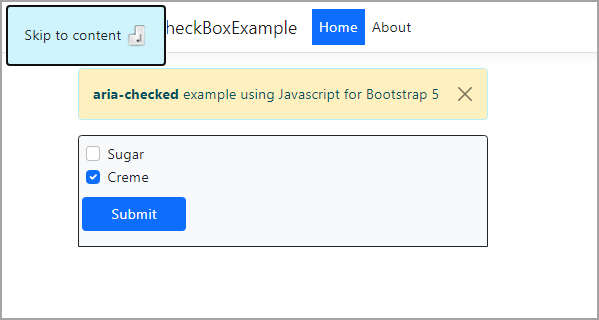

## Checkboxes and aria-checked

:open_book: [checkbox documentation](https://getbootstrap.com/docs/5.0/forms/checks-radios/)

When a developer decides to make their web application WCAG AA accessible there are additional considerations which in this project two topics are covered at a basic level.

First, using check boxes that allow a screen reader to know if a check box is checked or not which can only be done with setting the appropriate attributes and some JavaScript.

Setup for a checkbox

```html
<div class="form-check">
    <input class="form-check-input"
           type="checkbox"
           value=""
           name="coffeeToppings"
           id="addCreme"
           aria-checked="True">

    <label class="form-check-label" for="addCreme">Creme</label>
</div>
```

In the above example toggling the `checked` state does not toggle `aria-checked`. JavaScript is needed as per below.

```javascript
// get all check boxes by bootstrap class
var checkboxes = document.getElementsByClassName("form-check-input");

// setup logic to toggle aria-checked
for(let index = 0;index < checkboxes.length;index++){

    checkboxes[index].onclick = function(){

        if (checkboxes[index].getAttribute('aria-checked') === 'true') {
            checkboxes[index].setAttribute('aria-checked', 'false');
        } else {
            checkboxes[index].setAttribute('aria-checked', 'true');
        }
    };
}
```

## Skip links



Skip links are a means of bypassing blocks of content that is repeated on multiple web pages. 

> **Note**
> The index page anchor is the form, to access the check boxes press <kbd>tab</kbd>

In this code sample, styling is done in `site.css`

```css
.skiplink {
    position: absolute;
    left: 5px;
    top: 0;
    transform: translateY(-100%);
    transition: transform 0.3s;
    background: #cff4fc;
    color: black;
    padding: 20px;
}

.skiplink:focus {
    transform: translateY(0);
    color: white;
}
```

We setup a link in `_Layout.cshtml`

```html
<body>
    <header>
        <nav class="navbar navbar-expand-sm . . .">
            <div class="container">
                <a class="skiplink mb-4 text-dark" style="text-decoration: none;"
                   id="skipper"
                   asp-fragment="main-content"
                   aria-label="Skip to content">
                    Skip to content 
                </a>
```

In the above example an image of a keyboard <kbd>enter</kbd> key is used.

In each page add the following JavaScript which when pressing <kbd>ALT</kbd> + <kbd>0</kbd> causes the skip link to appear.

```javascript
$(this).on('keydown', function (event) {
    if (event.key === '0' && event.altKey) {
        $("#skipper").focus();
    }
});
```

Optionally place the above code in a centeral JavaScript class.

## Highlight current page in navigation

Suppose someone can into a site not from the main page, without the current menu item being highlighted they may not know where they are at.

To solve this, in `site.js` add the following and adjust colors to suite you needs.

```javascript
document.addEventListener('DOMContentLoaded', () => {

    document.querySelectorAll('.nav-link').forEach(link => {

        link.classList.remove('text-dark');
        link.classList.remove('bg-primary');

        if (link.getAttribute('href').toLowerCase() === location.pathname.toLowerCase()) {
            link.classList.add('text-white');
            link.classList.add('bg-primary');
        } else {
            link.classList.add('text-dark');
        }
    });
})
```